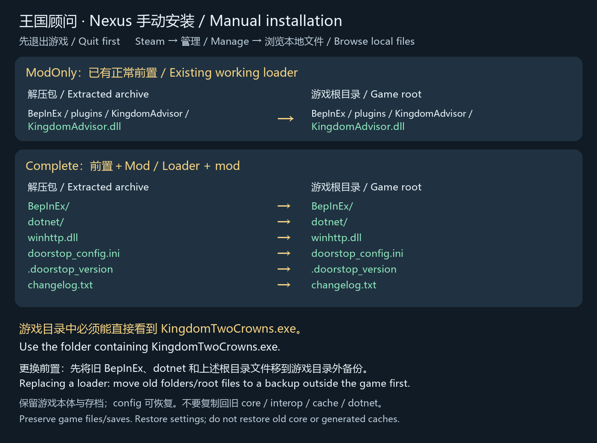

# 王国顾问 0.6.7-r2 — Nexus 手动安装

Nexus 下载包为手动安装版，不含自动安装脚本，不需要 PowerShell 7。插件版本仍为 0.6.7，玩法与已验收版本一致。

## 选择资源

- **ModOnly-Manual**：仅王国顾问。必须已有正常工作的 BepInEx 6 Unity IL2CPP Windows x64。现有游戏能加载 Mod 的玩家可选此包。
- **Complete-Manual**：本 Mod＋修复后的完整 BepInEx #788。适合首次安装，或遇到 `AndroidManager / RawPropertyType` 首次生成错误。该前置经过修改，并非纯官方 #788。

两个包任选一个。不要把 GitHub 的一键安装步骤用于 Nexus 手动包。

## 找到安装位置

Steam → 游戏库 → 右键 Kingdom Two Crowns → 管理 → 浏览本地文件。

能直接看到 `KingdomTwoCrowns.exe` 的文件夹就是游戏根目录。示例：`D:\SteamLibrary\steamapps\common\Kingdom Two Crowns\`。实际库盘符不限。

## ModOnly：已有前置时

1. 保存并正常退出游戏。
2. 解压下载包到普通文件夹。
3. 将包内 **BepInEx 文件夹**复制到游戏根目录，与原 BepInEx 合并，只覆盖 `plugins/KingdomAdvisor/KingdomAdvisor.dll`。
4. 保留其他插件和全部原配置，启动游戏。

正确路径：`游戏根目录/BepInEx/plugins/KingdomAdvisor/KingdomAdvisor.dll`。

## Complete：首次安装或更换前置

1. 保存并正常退出游戏。将下列备份放在**游戏根目录外**的独立文件夹；若其中项目不存在，跳过。
2. 已有前置时，将整个 `BepInEx`、整个 `dotnet` 文件夹及根目录 `winhttp.dll`、`doorstop_config.ini`、`.doorstop_version`、`changelog.txt` **移到备份中**。不要只把新核心覆盖到旧 core 上。
3. 将解压包内的 `BepInEx`、`dotnet` 以及上述四个根目录文件复制到含游戏 EXE 的目录。包内的 README、图片、许可证和源码信息不用放入游戏。
4. 从备份中复制回 `BepInEx/config`，以保留配置与岛屿记录。其他插件需要兼容新前置；确认后复制回它们自己的插件目录，王国顾问使用新包的版本。不要恢复旧 `core`、`interop`、`cache` 或 `dotnet`。
5. 正常启动游戏。首次启动需联网获取匹配的 Unity 基础库并生成程序集，可能需数分钟，请等待。
6. F7 打开图鉴，F6 打开设置。若启动失败，保存 `BepInEx/LogOutput.log`，按下面的方法恢复备份。

本包不含游戏本体、游戏程序集、配置、存档或生成缓存。请保留游戏原有 EXE、Data 文件夹和其他游戏文件。

## 放置示意



```text
解压 Complete-Manual 后，复制这些项目：
├─ BepInEx/           ─┐
├─ dotnet/             │ → 含 KingdomTwoCrowns.exe 的游戏目录
├─ winhttp.dll         │
├─ doorstop_config.ini │
├─ .doorstop_version   │
└─ changelog.txt      ─┘

安装后的游戏目录：
Kingdom Two Crowns/
├─ KingdomTwoCrowns.exe           ← 定位安装目录
├─ KingdomTwoCrowns_Data/         ← 保留游戏原有内容
├─ winhttp.dll
├─ doorstop_config.ini
├─ .doorstop_version
├─ changelog.txt
├─ dotnet/
└─ BepInEx/
   ├─ core/                      ← 整合包的新核心
   ├─ plugins/
   │  └─ KingdomAdvisor/
   │     └─ KingdomAdvisor.dll   ← Mod 的正确位置
   ├─ config/                    ← 原配置可复制回来
   └─ interop/                   ← 首次启动自动生成
```

ModOnly 包只提供上述插件路径。不要在游戏根目录再套一层下载包名称，不要形成 `BepInEx/BepInEx`，也不要放入 `KingdomTwoCrowns_Data`。

## 更新、卸载及回退

只更新 Mod：退出游戏，替换 `KingdomAdvisor.dll`，保留配置与前置。

只卸载 Mod：退出游戏，将 `BepInEx/plugins/KingdomAdvisor` 移出游戏目录；保留其他插件所需前置。

Complete 回退：退出游戏，将当前 `BepInEx`、`dotnet` 及本次复制的四个根目录文件移到另一个备份位置，再将安装前备份的项目复制回原位置。新装且没有原备份时，移走本次添加的前置与 Mod 文件即可；不要改动游戏文件或存档。

## 兼容与源码

已验收：Windows x64、游戏 2.4.2、Unity 6000.0.66f2，修复后的 #788 首次生成、重启与用户正常游玩。仅修改 `LibCpp2IL.dll` 和 `Cpp2IL.Core.dll`，其余前置组件来自官方 #788。全部 DLC、联机、其他游戏版本与其他插件组合未完整验证。

对应源码、补丁脚本及完整构建记录可从 [公开 GitHub 资源](https://github.com/boyl/kingdom-advisor/releases/tag/v0.6.7-r1) 获取；其中 Complete 下载包含固定版本的第三方源码。源码不安装进游戏。Nexus 包内保留第三方许可证全文和来源说明。
